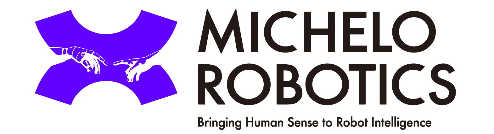
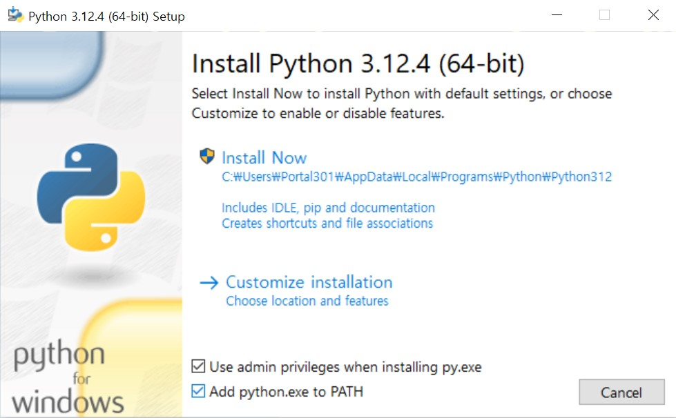
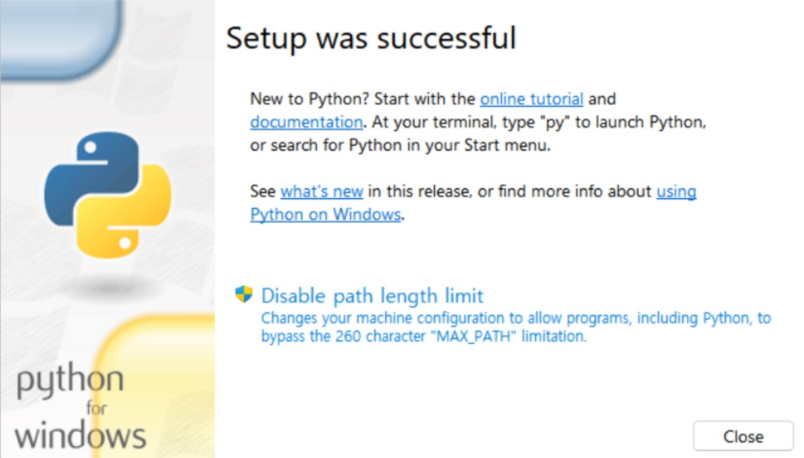

# Universal Robots Quick Tutorial 
<div align="center">
  
</div>

## Introduction


파이썬을 이용하여 유니버셜로봇을 외부 컴퓨터로 제어하고, 더 나아가 비전AI 연동까지 수행해보기 위한 프로젝트 페이지입니다.

유니버설 로봇 지정 트레이닝센터에서 오프라인 트레이닝 세션이 정기적으로 진행되며, 트레이닝센터의 로봇 시스템 구성은 아래와 같습니다.

- 파이썬 python version: 3.11.x ~ 3.13.x

- 로봇 모델 Robot model: UR3e

- 로봇 소프트웨어 버전 Polyscope version: 5.11 ~ 5.18  
      (*v5.21 ~ 5.22에서는 오류가 발견되었습니다.)

- 3D 카메라: 인텔 리얼센스 D435 시리즈

- 주변기기: URCaps Grippers(Robotiq two-finger gripper 등), IO제어 컨베이어벨트, IO 포토(위치)센서

- 네트워크: 로컬 네트워크 라우터 사용

- 비전AI: YOLO(detection, classification, segmentation)


위의 구성이 아니더라도 튜토리얼을 진행하는데는 크게 무리가 없을 것으로 생각합니다.

혹시 문제가 발생하거나 추가 요청사항이 있을경우 Issue탭에서 문의주세요 :)

## Acknowledgement
<div align="center">
   
</div>
본 튜토리얼은 서울대학교 로봇동아리 '시그마 인텔리전스(Sigma Intelligence)' 학생들의 도움을 받아 제작되었습니다.


## 주요 링크

- [UR remote control interface](https://www.universal-robots.com/articles/ur/interface-communication/remote-control-via-tcpip/)

## 프로젝트 다운받기

### ZIP file


1. ```<> Code``` 버튼 클릭
2.  ```Download ZIP``` 버튼 클릭 후 압축 해제하시면 됩니다.

### git clone (git bash 필요)
프로젝트 폴더 만든후 해당 폴더에서 터미널 실행 -> 터미널 프롬프트에서 아래 명령 입력

```bash
git clone git@github.com:portal301/ur-python-tutorial.git
```

## 개발 환경 설정하기

### VScode 설치
   [VSCode](https://code.visualstudio.com/download)

VScode에서 python extension과 ur script extension을 설치하세요.

### python 설치
  [Python](https://www.python.org/downloads/)
  
  **3.10.x - 3.12.x 버전 설치를 권장합니다.**


  - (주의) 설치 시 옵션에서 Add python to PATH(파이썬을 환경변수에 추가) 항목을 선택해주세요.

<div align="center">
  
</div>

- 설치 완료 후, Disable path length limit을 클릭해주세요. 경로이름이 너무 길어질 경우 파이썬이 인식되지 않는 경우가 있어 이를 해제해주는 것입니다.

<div align="center">
  
</div>

- VScode에서 파이썬을 제대로 인식한다면, 커맨드창에서 아래 명령 입력시 "python 3.x.x"가 출력됩니다. "python"만 출력된다면 인식이 되지 않은 상태입니다.


    python --version


- VScode에서 파이썬이 인식되지 않는다면 컴퓨터를 재부팅해보시기 바랍니다. 

### Python 패키지 설치

본 튜토리얼에서 필요한 기본 패키지들을 설치합니다
```
  pip install -r requirements.txt
```

AI를 학습하는 세션까지 진행하실 분들은 아래의 명령어로 파이토치를 설치해주세요. 
 
```
  pip install torch torchvision torchaudio --index-url https://download.pytorch.org/whl/cu118
```
혹시 이미 torch가 설치되어 있다면 아래의 명령어로 삭제후 다시 설치해주세요.
```
  pip uninstall -y torch torchvision torchaudio
  pip cache purge
```


### (optional) 파이썬 가상환경 설정하기
  아나콘다 설치하러가기
파이썬 프로젝트를 동시에 여러가지 진행할 경우 라이브러리 충돌이 발생할 수 있습니다. 가상환경은 라이브러리 저장공간을 분리하여 라이브러리 간의 충돌을 방지합니다.
수업에서 직접 다루지는 않지만, 배워두면 유용합니다.

### (optional) git bash

  [Git Bash](https://git-scm.com/)

  Github과의 호환성이 좋은 터미널 프로그램입니다.

### (optional) github copilot

  [Copilot](https://code.visualstudio.com/docs/copilot/overview)

  AI를 이용하여 개발속도를 극적으로 향상시킬 수 있습니다. 다만 기본이 부족한 상태에서 AI에 의존하게 되면 어느순간 벽을 만나게 될 수 있으니 지혜롭게 활용해보아요.

## 알아두면 좋은 터미널 프롬프트 명령어

- 하위 폴더로 이동
  ```bash
  cd {foldername}
  ```
- 상위 폴더로 이동
  ```bash
  cd .. 
  ```
- 폴더 내용 확인

  ### Windows CMD
  ```bash
  dir
  ```
  
  ### Linux/Mac
  ```bash
  ls
  ```
- 현재위치에서 VScode 실행
  ```bash
  code .
  ```
Written by AffineRobotics(Portal301)
