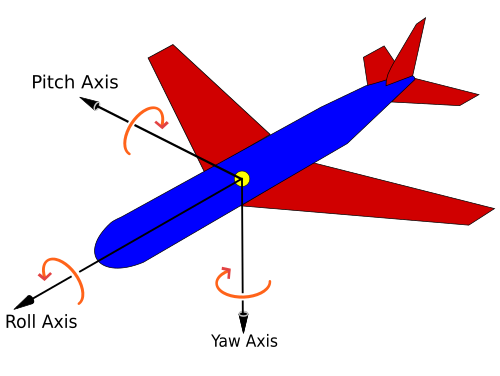

# Lecture 2: RealSense를 활용한 3차원 데이터 이해 실습

이 교육은 Intel RealSense 카메라를 활용하여 2D 이미지와 3D 거리 데이터를 실시간으로 수집하고, 이를 시각화 및 분석하는 과정을 단계적으로 학습합니다. 실습을 통해 RealSense의 영상을 받아오는 방법, 3D data를 처리하는 방법 등을 학습합니다. 

## 목차
- [Lecture 2: RealSense를 활용한 3차원 데이터 이해 실습](#lecture-2-realsense를-활용한-3차원-데이터-이해-실습)
  - [목차](#목차)
  - [0. RealSense란?](#0-realsense란)
    - [RealSense 카메라의 원리와 종류](#realsense-카메라의-원리와-종류)
    - [준비 사항](#준비-사항)
  - [1. 실시간 RGB + Depth 시각화](#1-실시간-rgb--depth-시각화)
    - [주요 함수 및 역할](#주요-함수-및-역할)
    - [실행 결과](#실행-결과)
  - [2. Intrinsics 파라미터 확인 및 중심 픽셀 3D 위치 추출](#2-intrinsics-파라미터-확인-및-중심-픽셀-3d-위치-추출)
    - [주요 함수 및 역할](#주요-함수-및-역할-1)
    - [출력 예시](#출력-예시)
  - [3. 마우스 클릭으로 픽셀 → 3D 좌표 변환 실습](#3-마우스-클릭으로-픽셀--3d-좌표-변환-실습)
    - [주요 함수 및 역할](#주요-함수-및-역할-2)
    - [실행 결과](#실행-결과-1)
  - [4. 자세 인식과 6DoF 개념 확장](#4-자세-인식과-6dof-개념-확장)
    - [6자유도 (6 Degrees of Freedom, 6DoF)란?](#6자유도-6-degrees-of-freedom-6dof란)
    - [왜 6DoF가 중요한가? (로봇 조작 관점)](#왜-6dof가-중요한가-로봇-조작-관점)
    - [자세 추정(Pose Estimation) 방법](#자세-추정pose-estimation-방법)
    - [Pick-and-Place 작업에서의 6DoF 적용 흐름](#pick-and-place-작업에서의-6dof-적용-흐름)
  - [5. 마무리](#5-마무리)


## 0. RealSense란?

Intel에서 개발한 **RGB-D 카메라**로, RGB 영상과 Depth 영상(거리 정보를 담은 이미지)을 동시에 제공합니다. RealSense 시리즈는 컴퓨터 비전 기반의 3D 인식 기능을 필요로 하는 다양한 애플리케이션(로봇, 드론, 증강현실, 사람 인식 등)에 널리 사용됩니다.

### RealSense 카메라의 원리와 종류

RealSense 카메라는 **스테레오 기반 깊이 측정**을 사용합니다. 본 교육에서 사용될 모델은 D435F이며 간략한 스펙은 다음과 같습니다. 

- Range: 0.3 - 3m
- Depth Accuracy: <2% at 2m
- Depth Filter: IR Pass
- RGB Frame: 1920x1080, 30fps
- Depth Frame: 1280x720, 90fps    


> 더 많은 기술적 정보와 API 문서는 Intel 공식 GitHub 저장소 [IntelRealSense/libRealSense](https://github.com/IntelRealSense/libRealSense)에서 확인할 수 있습니다.

### 준비 사항

- **하드웨어**: Intel RealSense (본 교육에서는 **D435F 모델** 사용)
- **소프트웨어 환경**: Python 3.8 이상

#### 설치해야 할 라이브러리

```bash
pip install pyRealSense2 opencv-python numpy
```

**numpy**: 행렬 및 벡터 연산을 효율적으로 처리하기 위한 수치 계산용 라이브러리입니다. RealSense에서 받은 Depth 데이터를 배열 형태로 다루는 데 필수적으로 사용됩니다.


## 1. 실시간 RGB + Depth 시각화

실시간으로 RGB와 Depth 영상을 수신하고 화면에 시각화하여 깊이 인식 감각을 형성합니다.

**예제 코드 (`1_RealSense.py`):**

### 주요 함수 및 역할

- `rs.pipeline()` / `cfg.enable_stream(...)`: 카메라 스트림 구성 및 시작  
- `wait_for_frames()`: 프레임 수신  
- `get_color_frame()`, `get_depth_frame()`: RGB / Depth 프레임 추출  
- `cv2.imshow(...)`: OpenCV 창에 영상 출력  
- `cv2.convertScaleAbs(...)` + `applyColorMap(...)`: Depth 데이터를 컬러맵으로 변환  
- `cv2.getWindowProperty(...)`: 창이 닫혔는지 감지하여 루프 종료  


### 실행 결과
실시간 컬러 영상과 컬러맵 처리된 Depth Map이 두 개의 창으로 표시  


## 2. Intrinsics 파라미터 확인 및 중심 픽셀 3D 위치 추출

RGB-D 카메라는 2D 이미지에서 각 픽셀이 실제 3D 공간상 어디에 위치하는지를 계산하기 위해 **카메라 내부 파라미터 (intrinsic parameters)** 를 사용합니다. 이 파라미터들은 RealSense SDK를 통해 자동으로 제공되며, 일반적으로 다음과 같은 항목들로 구성됩니다:

- `fx`, `fy`: 이미지 축(`x`, `y`) 방향의 **초점 거리 (focal length)**
- `cx`, `cy`: 이미지의 **중심점 (principal point)**  
- `width`, `height`: 이미지 해상도  
- `distortion_coeffs`: **렌즈 왜곡 계수**  
  - *RealSense는 Brown-Conrady 모델을 기본 사용하며, 경우에 따라 계수가 모두 0으로 설정되어 있기도 합니다.

이 Intrinsics 정보는 다음과 같은 작업에 필수적으로 사용됩니다.

- 2D 이미지에서 3D 포인트 복원
- 외부 캘리브레이션 매트릭스 계산
- SLAM, Visual Odometry, 포인트 클라우드 생성
- PnP 문제 해결을 통한 자세 추정 등

RealSense에서는 별도의 외부 캘리브레이션 없이도 위 정보를 API를 통해 기본적으로 제공하므로, 실습이나 프로토타이핑 단계에서는 즉시 활용할 수 있습니다.

**예제 코드 (`2_camera_intrinsics.py`):**

### 주요 함수 및 역할
`profile.as_video_stream_profile().intrinsics`: 카메라의 내부 파라미터 추출  
`get_distance(x, y)`: 특정 픽셀의 깊이값(depth)을 **미터 단위**로 반환  
`rs.rs2_deproject_pixel_to_point(...)`: 2D 픽셀 좌표 + depth → **3D 공간 좌표**로 변환  

### 출력 예시

```
Depth Camera Intrinsics:
  fx: 615.12, fy: 615.23
  cx: 320.00, cy: 240.00
  width: 640, height: 480

Pixel (320, 240)
 → Depth (Z): 0.833 m
 → 3D Position [X, Y, Z] (m): [0.0, 0.0, 0.833]
    X: right(+), Y: down(+), Z: forward(+)
```


## 3. 마우스 클릭으로 픽셀 → 3D 좌표 변환 실습  
RGB 화면에서 사용자가 클릭한 픽셀의 3D 위치를 실시간으로 확인합니다. 이를 위해서는 RGB 영상과 depth 영상의 픽셀 좌표를 일치시켜야 합니다. 이 과정으로 정렬(align)이라고 부릅니다. 

> **RGB-Depth 정렬 (`align`)**:  
> RealSense는 Color 센서와 Depth 센서가 서로 다른 위치에 장착되어 있기 때문에, 두 이미지의 픽셀 좌표가 일치하지 않을 수 있습니다. `rs.align(rs.stream.color)`을 사용하면 Depth 프레임을 RGB 프레임 기준으로 정렬하여, 동일한 픽셀 좌표계에서 처리할 수 있습니다.

또한, RealSense는 다음과 같은 카메라 좌표계를 가집니다. 

> **3D 좌표계 기준 (카메라 좌표계)**:   
`rs.rs2_deproject_pixel_to_point()`로 얻은 3D 좌표는 RealSense 카메라 좌표계를 따릅니다.  
 X: 오른쪽으로 갈수록 +  
 Y: 아래로 갈수록 +  
 Z: 카메라에서 멀어질수록 + (정면 방향)  


**예제 코드 (`3_click_to_3d.py`):**


### 주요 함수 및 역할

- `cv2.setMouseCallback(...)`: 마우스 클릭 이벤트 연결  
- `align = rs.align(rs.stream.color)`: RGB와 Depth 프레임 정렬  
- `get_distance(x, y)`: 클릭한 위치의 거리값 추출  
- `rs.rs2_deproject_pixel_to_point(...)`: 2D 픽셀을 3D 좌표로 변환  


### 실행 결과

RGB 창에서 아무 위치나 클릭하면 해당 좌표의 깊이 및 3D 위치가 콘솔에 출력

```
Clicked Pixel: (312, 254)
 → Depth (Z): 0.782 m
 → 3D Position [X, Y, Z] (m): [0.017, -0.005, 0.782]
```

**참고:**  
일부 픽셀에서는 적외선 센서가 거리 정보를 인식하지 못할 수 있습니다. 이 경우 `get_distance(x, y)`가 `0,0`을 반환하며, 3D 좌표 계산 결과도 `[0.0, 0.0, 0.0]`처럼 **의미 없는 값**이 됩니다. 따라서 클릭 좌표의 깊이값이 0인 경우는 반드시 **예외 처리**가 필요합니다.

## 4. 자세 인식과 6DoF 개념 확장

### 6자유도 (6 Degrees of Freedom, 6DoF)란?

6DoF는 3차원 공간에서 물체의 **자세(Pose)**를 완전히 표현하기 위한 **6개의 자유도**를 의미합니다. 3가지 **위치 이동**과 3가지 **회전**을 포함합니다:

#### 위치 이동 (Translation)
| 축 | 방향 |
|----|------|
| X  | 좌우 (왼쪽↔오른쪽) |
| Y  | 상하 (위↔아래) |
| Z  | 전후 (앞↔뒤, 카메라로부터 거리) |

#### 회전 (Rotation)
| 회전 | 설명 |
|------|------|
| **Roll**  | 물체를 앞 방향 축을 기준으로 좌우로 기울임(비행기 좌우 틀기) |
| **Pitch** | 옆 방향 축을 기준으로 위아래로 기울임 (고개 끄덕이기) |
| **Yaw**   | 위에서 보는 방향 기준 좌우 회전 (방향 바꾸기) |

<p align="center">
  
</p>  

<p align="center">
  출처: <a href="https://en.wikipedia.org/wiki/Aircraft_principal_axes">Wikipedia - Aircraft principal axes</a>
</p>

> **6DoF = 3D 위치 + 3D 방향**

### 왜 6DoF가 중요한가? (로봇 조작 관점)

로봇이 물체를 "정확히 잡으려면", 물체의 **위치만**이 아니라 **방향**도 알아야 합니다.

| 분야 | 이유 |
|------|------|
| **물체 집기 (Pick-and-Place)** | 그리퍼를 물체의 방향에 맞게 정렬해야 정확히 잡을 수 있음 |
| **경로 계획 (Motion Planning)** | 목표 위치뿐 아니라 **목표 자세**까지 이동해야 함 |
| **딥러닝 물체 인식** | Bounding box만으로는 방향 정보가 없기 때문에 자세 추정이 필요 |
| **SLAM / AR / 드론 제어** | 현재 위치 + 방향 정보를 추적해야 정확한 제어 가능 |


### 자세 추정(Pose Estimation) 방법


- **PnP (Perspective-n-Point)**: 3D 모델의 키포인트와 2D 이미지 상 점들을 매칭해 자세 추정  
- **PoseCNN, PVN3D 등**: RGB-D 기반 딥러닝 네트워크로 end-to-end 자세 추정  
- **ArUco 마커**: 특정 마커를 카메라가 인식하여 6DoF 자세 계산
- **Point Cloud Matching**: 센서로부터의 포인트 클라우드를 정합하여 물체 자세 추정

### Pick-and-Place 작업에서의 6DoF 적용 흐름

1. **YOLO**로 물체 2D 바운딩 박스 탐지  
2. 중심 픽셀 + Depth로 (x, y, z) 위치 계산  
3. 회전(Roll, Pitch, Yaw) 추정 → 전체 Pose 얻기  
4. 이 Pose를 로봇의 End-effector 목표 자세로 변환  
5. 역기구학(Inverse Kinematics)으로 경로 생성  
6. 로봇 그리퍼가 접근하여 정확하게 grasp


## 5. 마무리

이번 실습에서는 Intel RealSense 카메라를 활용해 2D 이미지와 깊이 정보를 실시간으로 받아들이고, 이를 기반으로 픽셀 단위의 3D 위치를 계산하는 방법을 학습했습니다. 
또한 3차원 공간에서 물체의 자세를 완전히 정의하는 6자유도(6DoF) 개념과, 이를 로봇 조작에 어떻게 적용할 수 있는지도 함께 알아보았습니다.