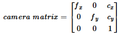
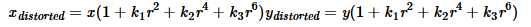
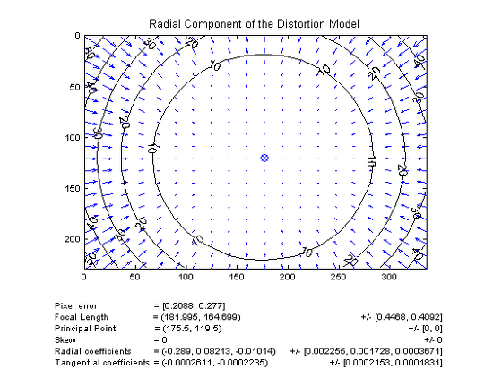
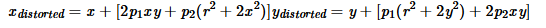
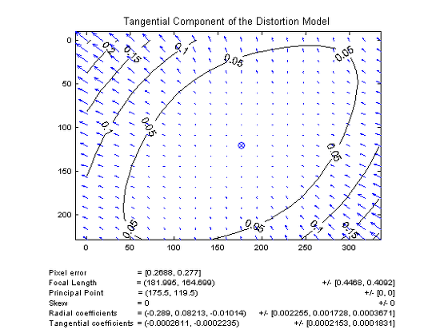
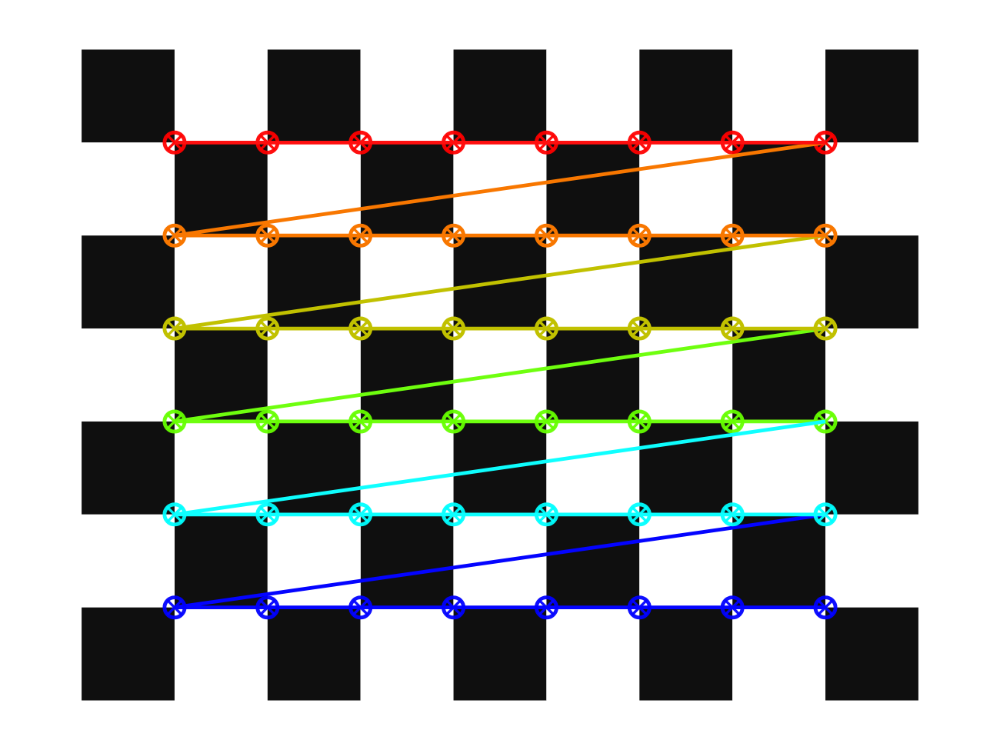

# Lecture 3: Camera Calibration

이 교육에서는 수집한 2D 이미지에서 카메라 렌즈에 의해 발생할 수 있는 왜곡을 보정하는 Camera Calibration 과정을 학습합니다.

## 목차
- [Lecture 3: Camera Calibration](#lecture-3-camera-calibration)
  - [목차](#목차)
  - [1. 카메라에서 발생하는 왜곡의 종류](#1-카메라에서-발생하는-왜곡의-종류)
  - [2. 체커보드를 이용한 Intrinsic Parameter 추출](#2-체커보드를-이용한-intrinsic-parameter-추출)
  - [3. Intrinsics Parameter를 이용한 보정 이미지 추출](#3-intrinsics-parameter를-이용한-보정-이미지-추출)
  - [3. 마무리](#3-마무리)


## 1. 카메라에서 발생하는 왜곡의 종류

카메라는 고유의 Intrinsic parameter가 존재합니다. 이는 **초점 거리** $f_x, f_y$, **광학 중심** $c_x, c_y$ 값을 의미합니다. 위 계수들은 다음과 같은 camera matrix로 표현됩니다.



또한 카메라 렌즈에 의해, 다음 두가지 종류의 왜곡이 발생합니다.

- **Radial distortion (방사왜곡)**: 
  - 볼록렌즈의 굴절에 의해 발생하며, 영상 중심으로 부터의 거리에 의해 왜곡의 정도가 결정됩니다.
  - 이때, 영상 중심으로 부터의 거리 $r$에 대하여, 왜곡의 정도는 다음과 식으로 모델링됩니다. 


- **Tangentional diostortion (접선왜곡)**:
  - 카메라 렌즈와 이미지 센서(CCD, CMOS)의 수평이 맞지 않아 발생하는 왜곡이며, 중심으로부터 타원 형태의 왜곡을 발생시킵니다.
  - 왜곡의 정도는 다음과 식으로 모델링됩니다. 



왜곡의 모델링에서 사용되는 계수 $k_1, k_2, p_1, p_2, k_3$ 구할 수 있다면 각 좌표에서 발생하는 방사왜곡과 접선왜곡의 정도를 구할 수 있습니다. 이를 이용하여 왜곡을 제거한 image를 구하면 Camera Calibration을 수행할 수 있을 것 입니다.

---

## 2. 체커보드를 이용한 Intrinsic Parameter 추출

Camera Calibration을 수행하기 위해서는 보정하고자 하는 이미지 내에 3차원 좌표를 정확히 알 수 있는 기준점이 존재해야 합니다. 따라서, 다음과 같은 체커보드를 이용하여 기준점을 설정하고자 합니다.
<center></center>

체커보드의 각 칸 간격의 정확한 규격을 알고 있으므로, 이미지 상에서 나타나는 꼭짓점들을 xy평면 상의 기준점으로 설정할 수 있습니다. 위 점들을 이용하여 카메라의 Intrinsic Parameter를 구해낼 수 있습니다.
<center></center>


#### 예제 코드 (`1_get_intrinsic_param.py`):

#### 주요 함수 및 역할

```python
# Vector for 3D points 
threedpoints = [] 
# Vector for 2D points 
twodpoints = [] 
# 3D points real world coordinates 
objectp3d = np.zeros((1, CHECKERBOARD[0] 
					* CHECKERBOARD[1], 
					3), np.float32) 
objectp3d[0, :, :2] = np.mgrid[0:CHECKERBOARD[0], 
							0:CHECKERBOARD[1]].T.reshape(-1, 2) 
```
- `threedpoints`: 3차원 좌표를 저장할 리스트입니다.
- `twodpoints`: 2차원 좌표를 저장할 리스트입니다.
- 이후 `objectp3d`는 체커보드의 각 꼭짓점의 3차원 좌표를 저장합니다. `CHECKERBOARD`는 체커보드의 크기를 나타내며, `np.mgrid`를 이용하여 2차원 격자 형태로 좌표를 생성합니다.

```python
images = glob.glob(os.path.join("camera_params","calibration_data","*.jpg"))

for filename in images: 
	image = cv2.imread(filename) 
```
- 폴더 경로내에 있는 모든 jpg 파일을 차례로 읽어와서 cv2로 읽은 뒤 image변수로 저장합니다.

```python
ret, corners = cv2.findChessboardCorners( 
        grayColor, CHECKERBOARD, 
        cv2.CALIB_CB_ADAPTIVE_THRESH 
        + cv2.CALIB_CB_FAST_CHECK +
        cv2.CALIB_CB_NORMALIZE_IMAGE) 
```
- 주어진 이미지에서 체커보드 격자판의 꼭짓점을 감지합니다. 인자로는 이미지의 흑백사진 (`grayColor`), 체커보드의 크기 (`CHECKERBOARD`), 그리고 기타 감지 옵션들이 있습니다. 
- 반환값은 감지 성공 여부 (`ret`)와 감지된 꼭짓점들의 좌표 (`corners`)입니다.

```python
if ret == True: 
  threedpoints.append(objectp3d) 
  # Refining pixel coordinates for given 2d points. 
  corners2 = cv2.cornerSubPix( grayColor, corners, (11, 11), (-1, -1), criteria) 
  twodpoints.append(corners2) 
  # Draw and display the corners 
  image = cv2.drawChessboardCorners(image, 
                  CHECKERBOARD, 
                  corners2, ret) 

```
- 체커보드가 감지되면, 3차원 좌표 (`objectp3d`)를 `threedpoints` 리스트에 추가하고, 이에 대응되는 감지된 2차원 좌표 (`corners2`)를 `twodpoints` 리스트에 추가합니다.

```python
ret, matrix, distortion, r_vecs, t_vecs = cv2.calibrateCamera( 
	threedpoints, twodpoints, grayColor.shape[::-1], None, None) 

...

json_data = {
    "camera_matrix": matrix.tolist(),
    "dist_coeff": distortion.tolist()
}
with open(os.path.join("camera_params","camera_intrinsic.json"), "w") as f:
    json.dump(json_data, f, indent=4)
```
- `cv2.calibrateCamera()` 함수를 이용하여 카메라의 Intrinsic Parameter를 계산합니다. 이 함수는 3차원 좌표와 2차원 좌표를 입력으로 받아 카메라 매트릭스 (`matrix`)와 왜곡 계수 (`distortion`)를 반환합니다.
- 계산된 카메라 매트릭스와 왜곡 계수를 JSON 형식으로 저장합니다. 이 파일은 이후 이미지 보정에 사용됩니다.


## 3. Intrinsics Parameter를 이용한 보정 이미지 추출

#### 예제 코드 (`2_calibrate.py`):

#### 주요 함수 및 역할
```python
new_camera_matrix, roi = cv2.getOptimalNewCameraMatrix(
        camera_matrix, dist_coeffs, (w, h), 1, (w, h)
    )
```
- `cv2.getOptimalNewCameraMatrix()`: 카메라 매트릭스와 왜곡 계수를 이용하여 최적의 새로운 카메라 매트릭스를 계산합니다. 이 함수는 이미지 크기와 ROI(Region of Interest)를 고려하여 새로운 카메라 매트릭스를 반환합니다.

```python
# 왜곡 제거
    undistorted_img = cv2.undistort(img, camera_matrix, dist_coeffs, None, new_camera_matrix)
```
- `cv2.undistort()`: 주어진 이미지에서 왜곡을 제거합니다. 입력으로는 원본 이미지, 카메라 매트릭스, 왜곡 계수, 그리고 새로운 카메라 매트릭스가 필요합니다.
- 이후 왜곡이 보정된 사진을 지정된 경로에 저장합니다.

#### 실행 결과

- `camera_params\undistorted` 폴더에 왜곡이 보정된 이미지들이 저장

    <center>
    
    
    보정 전

    
    
    보정 후
    </center>


## 3. 마무리

우리가 앞서 사용한 Realsense 3D 카메라는 내부적으로 distortion coefficient가 0으로 설정되어있기에, 이러한 보정 과정이 필요하지 않습니다. 그러나 일반적인 카메라를 사용할 경우, 위 과정은 필수적으로 수행되어야 합니다.
