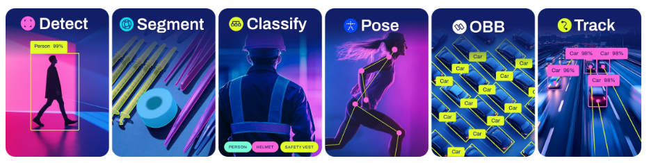
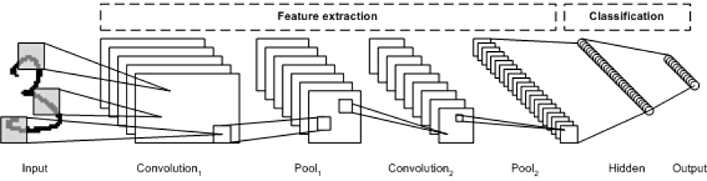

# Lecture 1: 비전 AI의 이해

이 강의에서는 비전 AI(Computer Vision + 인공지능)의 기본 개발, 주요 기술, 대표적인 모델과 활용 사례에 대해 학습합니다. 또한 이미지 데이터를 어떻게 처리하고, 이를 기반으로 학습/추론을 수행하는지 실습을 통해 경험해보고자 합니다.

## 목차
- [Lecture 1: 비전 AI의 이해](#lecture-1-비전-ai의-이해)
  - [목차](#목차)
  - [1. 비전 AI라는 것은?](#1-비전-ai라는-것은)
  - [2. 비전 AI 기술의 분류](#2-비전-ai-기술의-분류)
  - [3. 비전 AI의 기본 구조](#3-비전-ai의-기본-구조)
  - [4. 비전 AI의 원리](#4-비전-ai의-원리)
  - [3. 마무리](#3-마무리)

## 1. 비전 AI라는 것은?

**비전 AI**는 카메라나 이미지 센서로부터 얻은 데이터를 기반으로 **사람처럼 시각적 판단을 수행하는 AI** 기술을 의미합니다. 인간의 시각 정보 처리 능력을 모방하여, 물체 인식, 거리 측정, 자세 추정, 행동 분석, 자율주행 등 다양한 분야에 활용됩니다.

비전 AI는 다음의 두 분야를 결합한 형태입니다:

- **컴퓨터 비전 (Computer Vision)**: 이미지에서 의미 있는 정보를 추출
- **딥러닝 (Deep Learning)**: CNN 기반의 학습을 통해 추상화된 의미 해석

## 2. 비전 AI 기술의 분류

| 기술 분류                      | 설명                                |
| -------------------------- | --------------------------------- |
| **분류(Classification)**     | 이미지 전체가 어느 클래스인지 판단               |
| **탑지(Detection)**          | 이미지 내에서 객체의 위치와 클래스 탑지 |
| **분할(Segmentation)**       | 각 피케일 단위로 클래스 분류      |
| **추적(Tracking)**           | 특정 객체를 시간적으로 추적                   |
| **자세 추정(Pose Estimation)** | 물체 또는 사람의 관절/위치 추정                |

**Detection 모델 예시**

  
  

  ▲ 이미지를 클릭하면 YouTube에서 영상을 볼 수 있습니다.

**Pose Estimation 모델 예시**

  
  

  ▲ 이미지를 클릭하면 YouTube에서 영상을 볼 수 있습니다.

## 3. 비전 AI의 기본 구조

비전 AI는 보통 다음의 단계로 구성됩니다:

1. **데이터 수집**: 이미지, 영상, RGB-D 센서 등에서 데이터 수집
2. **전처리**: 크기 조정, 정규화, 증가 등
3. **모델 학습**: CNN 기반 모델(YOLO, ResNet 등)을 데이터에 맞게 학습
4. **추론**: 새로운 데이터에 대한 예측 수행
5. **후처리**: 좌표 변환 등

## 4. 비전 AI의 원리

비전 AI의 많은 모델은 **합성곱 신경망(CNN, Convolutional Neural Network)** 을 기반으로 동작합니다. 이 CNN의 핵심 아이디어는 **이미지의 공간 패턴(모양·색·경계)을 수학적으로 추출**하는 것입니다.

#### 2.1. 이미지의 행렬 표현
- 이미지 = **픽셀 값**에 대한 2차원 행렬(흑백) 또는 3차원 배열(RGB)
- 예: 100×100 픽셀 RGB 이미지 → 100×100×3 크기의 행렬로 표현

#### 2.2. 합성곱(Convolution)
- **수학식**:  
  $(I * K)(x, y) = Σ_i Σ_j I(x+i, y+j) · K(i, j)$ 
  여기서  
  - I = 입력 이미지  
  - K = 필터(커널)  
- 필터는 **엣지, 패턴, 질감** 등을 추출하는 작은 행렬을 의미합니다. 해당 필터 행렬과 입력 이미지의 합성곱으로, 이미지의 특성이 추출된 행렬이 구해집니다.
- 예를 들어, 필터 행렬이 테두리를 추출하는 필터 행렬이라면, 이미지에서 테두리 성분만 남은 이미지가 합성곱의 결과로 나오게 됩니다.

#### 2.3. 활성화 함수 (Activation Function)
- 합성곱 결과에 비선형 함수를 적용하여 **복잡한 패턴을 학습**  
- 대표: ReLU  
  f(x) = max(0, x)

#### 2.4. 풀링(Pooling)
- 이미지를 축소해 계산량을 줄이고, 중요한 특징만 남김
- **최대 풀링(Max Pooling)**: 영역의 최대값만 취함 → 노이즈 감소, 위치 변화에 강함

#### 2.5. 완전연결층(Fully Connected Layer, FC)
- 합성곱과 풀링으로 추출한 **특징 벡터**를 최종적으로 하나의 예측값으로 변환
- 수학적으로는 y = Wx + b 형태의 선형변환 + 활성화

#### 2.6. 학습 과정
- 모델은 **손실함수(Loss Function)** 를 최소화하도록 학습
- 예: 분류 문제에서 자주 쓰는 **교차엔트로피 손실**  
  $L = -Σ_i y_i log(ŷ_i)$
- **역전파(Backpropagation)** 로 가중치(필터 값)를 업데이트  
  → 경사하강법(Gradient Descent) 사용

## 3. 마무리
이번 실습에서는 비전 AI의 기본 개념과 원리를 이해하고, CNN의 작동 방식을 학습했습니다. 다음 강의에서는 실제로 비전 AI 모델을 구축하고, 이미지 데이터를 처리하는 방법에 대해 실습해보겠습니다.
