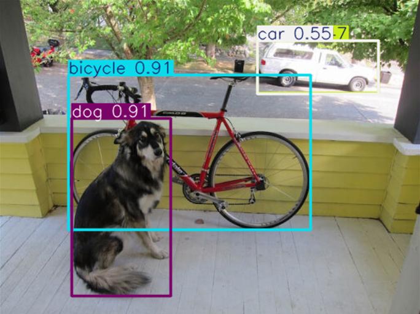

# Lecture 2: YOLO를 활용한 비전 AI 실습

이 강의에서는 객체 탐지(Object Detection)의 대표적인 딥러닝 모델인 YOLO(You Only Look Once)의 개념을 이해하고, 실제로 YOLO 모델을 설치 및 구성하여 이미지 내에서 사람을 검출하는 실습을 수행합니다.

## 목차
- [Lecture 2: YOLO를 활용한 비전 AI 실습](#lecture-2-yolo를-활용한-비전-ai-실습)
  - [목차](#목차)
  - [1. YOLO란?](#1-yolo란)
  - [2. YOLO 환경 구성](#2-yolo-환경-구성)
  - [3. Pretrained 모델을 이용한 Detection](#3-pretrained-모델을-이용한-detection)
    - [추가질문](#추가질문)
  - [4. 모델 Train 시키기](#4-모델-train-시키기)
    - [추가 질문](#추가-질문)
  - [5. 마무리](#5-마무리)


## 1. YOLO란?

YOLO는 이미지 전체를 한 번에 처리하여 객체의 위치와 클래스를 예측하는 **실시간 객체 탐지 모델**입니다. PyTorch 기반으로 구현되어 있으며, 간편한 설치와 다양한 모델 크기 옵션을 제공합니다.

#### YOLO의 특징

- 실시간 처리에 적합 (Fast and Lightweight)
- End-to-End 학습 구조
- 객체 탐지와 분류를 동시에 수행


## 2. YOLO 환경 구성

#### 요구사항

- Python 3.8 이상
- Ultralytics

#### 설치 방법

```bash
pip install ultralytics
```


## 3. Pretrained 모델을 이용한 Detection

#### 예제 코드 (`1_yolo_pretrained_detection.py`):
```python
from ultralytics import YOLO

if __name__ == "__main__":
	#가중치가 pretrain된 yolo11n 모델을 불러옵니다.
	#model = YOLO("yolo11n.pt")
	
	#비어있는 yolo11n 모델을 생성합니다.
	model = YOLO("yolo11n.yaml") 

	#비어있는 yolo11n 모델을 생성한 후, 모델을 불러옵니다.
	#model = YOLO("yolo11n.yaml").load("yolo11n.pt") 

	results=model(source="image/dog.png",save=True)
	results[0].show()  # Display results
```

- 해당코드는 yolo11n 모델을 생성하고, pretrained된 가중치 정보를 불러옵니다. 이후, 주어진 이미지에 대해 object detection을 수행합니다.

#### 실행 결과

- 사진에서 물체들이 성공적으로 감지되어 표시됩니다. 또한, `runs/detect/predict` 폴더에 detect된 이미지가 저장됩니다.

<center></center>

### 추가질문
사전 학습된 모델을 사용하지 않으면 어떤 결과가 발생할까요?


## 4. 모델 Train 시키기

#### 예제 코드 (`2_yolo_train.py`):
```python
from ultralytics import YOLO

if __name__ == "__main__":
	# Load a YOLO11n model
	model = YOLO("yolo11n.yaml")

	# Train the model on the COCO8 example dataset for 100 epochs
	results = model.train(data="coco8.yaml", epochs=100, imgsz=640, device='cuda')

	# Run inference with the YOLO11n model on the 'dog.png' image
	results = model("image/dog.png", save=True)
```

- 해당코드는 yolo11n 모델을 생성하고, coco8 데이터셋을 이용하여 모델을 학습시킵니다.
- coco8데이터셋은 총 8개의 이미지로 이루어져 있으며, 4개를 학습용 데이터로 사용하고 4개를 검증용 데이터로 사용합니다.

#### 실행 결과

- 학습과정에서, 터미널에 다음과 같이 출력됩니다.
```
      Epoch    GPU_mem   box_loss   cls_loss   dfl_loss  Instances       Size
     72/100     0.816G     0.5273     0.7046      1.038         19        640: 100%|██████████| 1/1 [00:00<00:00,  9.75it/s]
                 Class     Images  Instances      Box(P          R      mAP50  mAP50-95): 100%|██████████| 1/1 [00:00<00:00, 27.03it/s]
                   all          4         17      0.821      0.482      0.515      0.261
```
| 항목 이름         | 의미                                                   |
| ------------- | ---------------------------------------------------- |
| **Epoch**     | 현재 학습 중인 에폭 번호 (72번째 에폭, 총 100 중)                    |
| **GPU\_mem**  | 현재 학습에 사용된 GPU 메모리 (0.816 GB)                        |
| **box\_loss** | 바운딩 박스 위치 예측에 대한 손실값 (L1 또는 CIoU 기반)                 |
| **cls\_loss** | 클래스 예측(분류)에 대한 손실값                                   |
| **dfl\_loss** | DFL(Distribution Focal Loss) - 바운딩 박스의 정밀도 개선을 위한 손실 |
| **Instances** | 현재 배치에서 학습에 사용된 객체 인스턴스 수 (총 19개 객체)                 |
| **Size**      | 입력 이미지의 크기 (640×640)                                 |
| **Class**     | 평가 대상 클래스 ("all"은 전체 클래스 통합)                      |
| **Images**    | 평가에 사용된 이미지 수 (4장)                                |
| **Instances** | 총 객체 수 (17개)                                      |
| **Box(P)**    | Precision (정밀도): 예측한 것 중 정답 비율 (0.821)            |
| **R**         | Recall (재현율): 정답 중 맞춘 비율 (0.482)                  |

- `runs/detect/train` 폴더에 train의 결과가 저장됩니다.
- `runs/detect/train/val_batch0_pred.jpg` 에 검증용 데이터셋에 대한 검증 결과가 저장됩니다. `runs/detect/train/val_batch0_labels.jpg`와 비교해 봤을 때 검증에 실패함을 확인할 수 있습니다.

#### 실패 원인

- coco8은 주로 코드 테스트용으로 활용되는 데이터셋으로, 실제 의미있는 학습을 하기에는 데이터셋의 양이 적습니다.
- 데이터셋의 양이 적을때는, `3_yolo_train_pretrained.py`와 같이 pretrained된 모델을 불러온 뒤 그 지점에서 부터 가중치를 개선해나가는 것이 권장됩니다. 

#### 예제 코드 (`3_yolo_train_pretrained.py`)

#### 실행 결과

- `runs/detect/train` 폴더에 train의 결과가 저장됩니다.
- `runs/detect/train/val_batch0_pred.jpg` 에 검증용 데이터셋에 대한 검증 결과가 저장됩니다. `runs/detect/train/val_batch0_labels.jpg`와 비교해 봤을 때 검증에 성공함을 확인할 수 있습니다.
- 또한, 학습 결과로 얻은 가중치는 `runs/detect/train/weight` 폴더에 저장됩니다. `best.pt`는 가장 오차가 적었던 epoch에서의 가중치이며, `last.pt`는 가장 마지막 epoch에서의 가중치 입니다. 저장된 가중치를 불러와 학습 단계를 생략하고 사용 가능합니다.

#### 예제 코드 (`4_load_trained_model.py`)

#### 실행 결과

- (`3_yolo_train_pretrained.py`) 에서 저장한 가중치를 불러오고, 이를 이용하여 실시간으로 불러와지는 camera 영상에 object detection을 적용합니다.


### 추가 질문
- Epoch는 정해진 데이터셋을 이용하여 학습을 반복하는 횟수를 의미합니다. Epoch수가 과하게 커지게 되면, 모델에 어떤 문제가 생길 수 있을까요?


## 5. 마무리

YOLO는 객체 탐지를 위한 매우 강력하면서도 빠른 도구로, 다양한 비전 AI 응용에 사용됩니다. 이번 실습에서는 YOLO를 설치하고 object detection 과정을 수행했습니다.

다음 실습에서는 주어진 PCB 기판의 이미지에서 결함 사항을 탐지하고, 이를 자동으로 탐지하는 모델을 실습 해보겠습니다.

