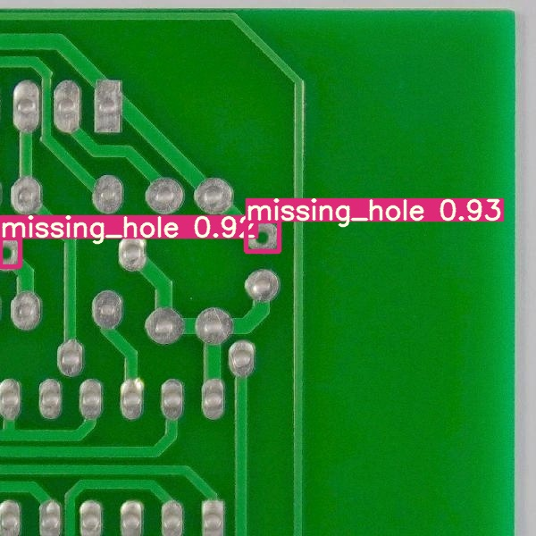
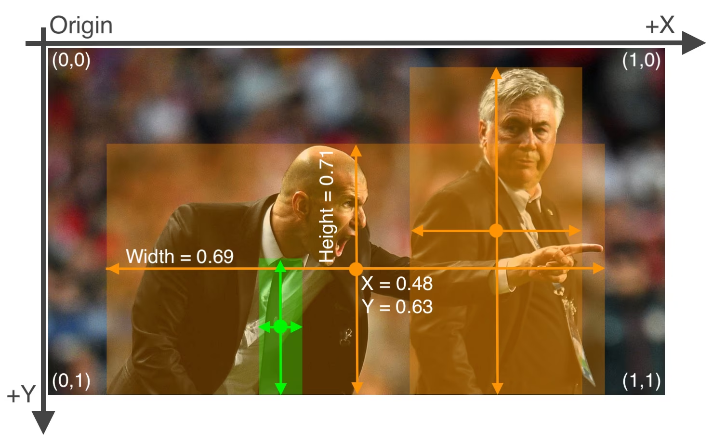
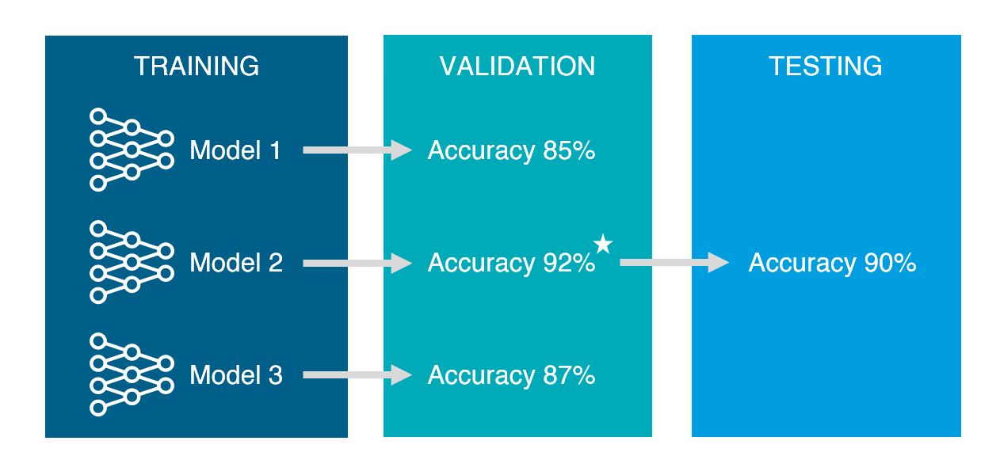
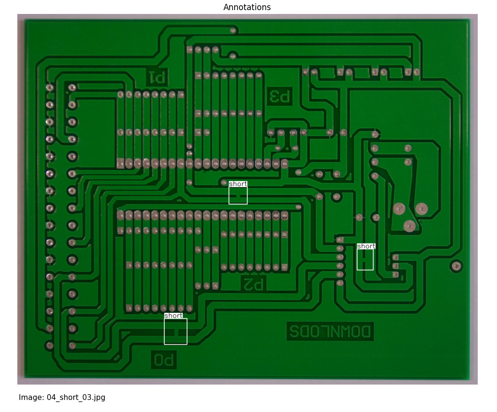

# Lecture 3: PCB 결함 탐지 실습

이 강의에서는 PCB(Printed Circuit Board) 이미지 내에 존재하는 결함들을 탐지하기 위한 YOLO 모델의 활용 방법을 학습합니다. 실제 PCB 이미지를 사용하여 결함 탐지 모델을 학습하고 평가하는 과정을 진행합니다.

<center></center>

#### Reference
- https://www.kaggle.com/code/tatianakushniruk/pcb-defect-detection-with-yolov8
- https://www.kaggle.com/code/tatianakushniruk/pcb-defect-detection-with-yolov8/notebook


## 목차
- [Lecture 3: PCB 결함 탐지 실습](#lecture-3-pcb-결함-탐지-실습)
  - [목차](#목차)
  - [1. 데이터 셋 구조의 이해](#1-데이터-셋-구조의-이해)
    - [추가 질문](#추가-질문)
  - [2. 데이터 셋 전처리](#2-데이터-셋-전처리)
  - [3. 데이터 셋 학습](#3-데이터-셋-학습)
    - [더 해보기](#더-해보기)
    - [추가 질문](#추가-질문-1)
  - [4. 마무리](#4-마무리)


## 1. 데이터 셋 구조의 이해

YOLO 공식 사이트에서는 다양한 데이터셋을 기본으로 제공하고 있습니다. (https://docs.ultralytics.com/ko/datasets/detect/) 해당 데이터셋들은 모델 내에서 그 이름을 호출할 시 별도의 외부 다운로드 없이 사용할 수 있습니다. (이전 Lecture 2에서 사용했던 COCO8 데이터셋의 이것의 예시입니다.)

 하지만 YOLO 기본제공 데이터셋이 모든 사물에 대한 정보를 포함하고 있지는 않습니다. 또한, 특정 상황에서는 그 상황에 맞는 사물만 포함된 컴팩트한 데이터셋이 필요할 수 있습니다. 따라서 우리는 필요한 데이터들을 직접 수집 하여 사용하거나, 인터넷 상에서 다양한 사람들이 만들어 놓은 데이터셋을 활용해야 합니다. 아래는 데이터셋을 찾을 수 있는 몇 가지 사이트입니다.

- **Kaggle** https://www.kaggle.com
	- 인공지능 학습 데이터 및 코드들을 모아둔 사이트이며, 구현하고자 하는 모델에 맞는 데이터셋을 쉽게 찾을 수 있습니다.
- **Roboflow** https://roboflow.com
	- 데이터셋 전처리를 위해 사용되는 웹사이트 이며, 다른이들이 만들어놓은 데이터셋을 쉽게 찾을 수 있습니다.
	- 6일차에서는 해당 웹사이트를 이용해 직접 데이터셋을 만들어 볼 예정입니다. 


그러나, 이와 같은 사이트들에서 제공하는 데이터셋은 우리가 사용하는 인공지능 모델에 맞게 전처리되어 있지 않은 경우가 많습니다. 따라서, 데이터셋을 다운로드한 후에는 해당 데이터셋을 인공지능 모델이 학습할 수 있는 형태로 변환하는 과정이 필요합니다.

https://www.kaggle.com/code/tatianakushniruk/pcb-defect-detection-with-yolov8 에는 이번 실습에 활용할 결함이 포함된 PCB 이미지 데이터셋이 담겨져 있습니다. 해당 **Kaggle** 데이터셋 폴더는 다음과 같이 구성되어 있습니다.

```
dataset_pre/
 PCB_dataset/
  - images/
   - Missing_hole/
    - *.jpg
  - Annotations/
   - Missing_hole/
    - *.xml
```

현재 데이터셋 폴더는 **images**와 **Annotations** 폴더로 나누어져 있고, 각각의 폴더 안에 결함 종류에 따른 하위 폴더가 존재합니다.

**Annotations** 폴더안에는 **images** 폴더에 들어있는 그림 파일들과 대응되는 이름을 가진 XML 파일들이 있습니다. 이 XML 파일들은 각 이미지에 대한 라벨 정보를 담고 있습니다. 예를 들어, `Missing_hole_1.jpg`라는 이미지에 대한 XML 파일은 다음과 같은 형태입니다:
```xml
<annotation>
    <folder>images</folder>
    <filename>Missing_hole_1.jpg</filename>
    <path>/path/to/images/Missing_hole/Missing_hole_1.jpg</path>
    <source>
        <database>Unknown</database>
    </source>
    <size>
        <width>640</width>
        <height>480</height>
        <depth>3</depth>
    </size>
    <object>
        <name>Missing_hole</name>
        <pose>Unspecified</pose>
        <truncated>0</truncated>
        <difficult>0</difficult>
        <bndbox>
            <xmin>100</xmin>
            <ymin>100</ymin>
            <xmax>200</xmax>
            <ymax>200</ymax>
        </bndbox>
    </object>
</annotation>
```

위와 같은 데이터셋을 YOLO11 Detection 모델에서 사용하기 위해서는, 다음과 같은 변환 과정을 거쳐야 합니다.

> 1. 주석(Label) 파일 형식 수정
> 2. Train, Valid, Test 셋 구분
> 3. `data.yaml` 생성

#### 1. 주석(Label) 파일 형식 수정

`<bndbox>` 안에 있는 내용이 PCB 이미지 내 결함이 존재하는 영역의 픽셀상의 좌표를 의미합니다. 

우리가 실습에서 사용한 YOLO11 Detection 모델은 XML 형식의 주석 파일을 사용하지 않고, txt 파일을 사용합니다. txt 파일은 각 이미지에 대한 라벨 정보를 담고 있으며, 각 객체의 클래스와 바운딩 박스 좌표를 포함합니다. 예를 들어, `Missing_hole_1.jpg`라는 이미지에 대한 YOLO 형식의 주석 파일은 다음과 같은 형태입니다:

```
0 0.23 0.31 0.16 0.21
```

이때, 위 숫자들은 차례대로 **클래스ID, 중심 x좌표, 중심 y좌표, 너비, 높이**를 나타냅니다. 중심 좌표와 너비, 높이는 이미지 크기에 대한 상대적인 값으로 표현됩니다.

<center></center>

#### 2. Train, Valid, Test 셋 구분

데이터셋을 Train, Valid, Test 셋으로 나누어야 합니다. Train셋은 모델을 학습하는 데 직접적으로 사용됩니다. Valid 셋은 학습한 모델의 성능을 검증하는 데 사용되며, 인공지능 모델은 학습후 나온 Valid 셋 값에 따라서 평가 점수가 높아지는 방향으로 가중치를 조정합니다. Test 셋은 최종 모델의 성능을 평가하는 데 사용됩니다.
<center></center>

#### 3. `data.yaml` 생성

YOLO11 Detection 모델에서 사용하는 데이터셋은 데이터셋을 관리하는 `data.yaml` 파일에 정의되어 있어야 합니다. 이 파일에는 Train, Valid, Test 셋의 경로와 클래스 정보가 포함되어 있습니다. 아래는 최종적인 데이터셋의 `data.yaml` 입니다.

```yaml
train: images/train
val: images/val
test: images/test

names: 
  0: missing_hole
  1: mouse_bite
  2: open_circuit
  3: short
  4: spur
  5: spurious_copper
```

### 추가 질문

- Train 셋은 70%, Valid 셋은 20%, Test 셋은 10%의 비율로 나누는 것이 일반적입니다. Train 셋의 비율이 과하게 높으면 어떤 문제점이 발생할 수 있을까요?


## 2. 데이터 셋 전처리

`1_convert_dataset.py`를 실행해 줍시다. 해당 파일은 지정된 폴더 내의 XML 형식의 주석 파일을 YOLO 형식의 txt 파일로 변환하는 역할을 합니다. 이 과정에서 각 이미지의 크기를 640x640으로 조정하고, 바운딩 박스 좌표를 YOLO 형식에 맞게 변환합니다.

#### 실행 결과

다음과 같이 기존의 데이터셋 폴더를 분석한 결과가 터미널에 출력됩니다.

```
dataset_pre\Annotations
dataset_pre\images
dataset_pre\images_resized
dataset_pre\PCB_USED
dataset_pre\Annotations\Missing_hole
dataset_pre\Annotations\Mouse_bite
dataset_pre\Annotations\Open_circuit
dataset_pre\Annotations\Short
dataset_pre\Annotations\Spur
dataset_pre\Annotations\Spurious_copper
dataset_pre\images\Missing_hole
dataset_pre\images\Mouse_bite
dataset_pre\images\Open_circuit
dataset_pre\images\Short
dataset_pre\images\Spur
dataset_pre\images\Spurious_copper
Missing_hole                        115 images              115 annotations
Mouse_bite                          115 images              115 annotations
Open_circuit                        116 images              116 annotations
Short                               116 images              116 annotations
Spur                                115 images              115 annotations
Spurious_copper                     116 images              116 annotations
```

또한, 화면상에 테스트용 이미지를 불러와 시각화 하여 주석이 성공적으로 불러와 졌는지 확인할 수 있습니다.

<center></center>

이후, 기존 데이터셋 폴더에 output이라는 폴더가 추가되어 YOLO11n Detection모델에 사용하는 데이터 셋을 얻을 수 있습니다.


## 3. 데이터 셋 학습

`2_train.py`를 실행합니다. 

```python
from ultralytics import YOLO

if __name__ == '__main__':
    # Load a model
	model = YOLO("yolo11n.yaml").load("yolo11n.pt")  # build from YAML and transfer weights
	# Train the model
	results = model.train(data="datasets/data.yaml", epochs=50, imgsz=640, device=0)
```

해당 코드는 사전 학습된 yolo11n 가중치를 불러오고, 추가적으로 data.yaml 파일에 정의된 데이터셋을 사용하여 모델을 학습합니다. 
이후, `runs/train` 에 학습 결과가 저장됩니다.

- `weights` 폴더에는 학습된 가중치가 저장되며, 가장 마지막 epoch의 가중치는 `last.pt`로, 가장 성능이 좋은 epoch의 가중치는 `best.pt`로 저장됩니다.
- `val_batch0_labels.jpg`에는 검증에 활용한 데이터 사진이, `val_batch0_pred.jpg` 모델이 예측한 데이터 사진이 저장됩니다. 이는 트레인셋에 대해서도 동일합니다.

<center></center>

### 더 해보기
- 학습이 완료된 뒤, 저장된 가중치를 모델로 불러오는 코드를 작성해 봅시다. 이후 해당 모델을 사용하여 임의의 PCB 이미지에 대한 결함 탐지를 수행해 봅시다.

### 추가 질문
- 위와 같은 기술을 응용하여, PCB 결함 탐지 이외에 어떤 분야의 산업에서 활용할 수 있을까요?


## 4. 마무리
해당 실습에서는 Yolo11 모델을 이용하여 실제 산업에서 활용할만한 PCB 결함 탐지 모델을 학습하는 과정을 진행했습니다. 다음 실습에서는 YOLO classification모델을 이용하여 자동화 과일 분류 시스템을 실습해 보도록 하겠습니다. 