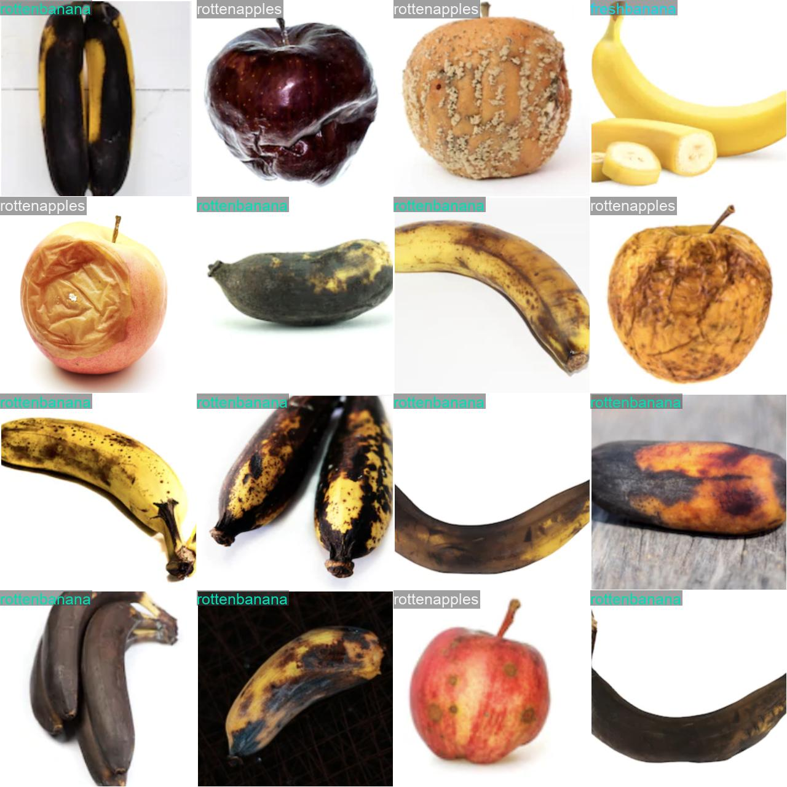
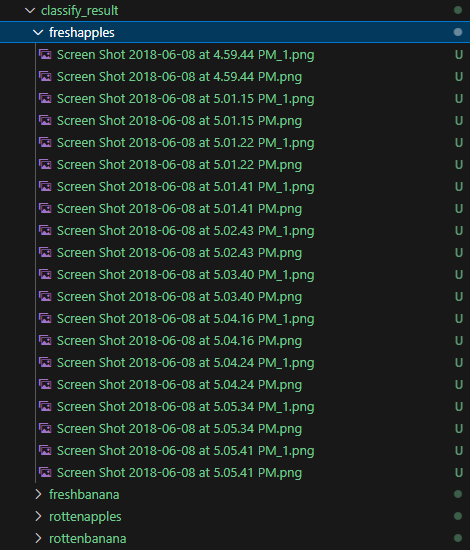

# Lecture 4: 과일 자동 분류 실습

이 강의에서는 YOLO classification 모델을 이용하여, 여러장의 과일 이미지가 주어졌을 때 해당 이미지들을 분류하는 실습을 진행하고자 합니다. 해당 실습에서 진행한 과제는 스마트 팜, 자동화 농장 등에서 응용할 수 있을 것 입니다.

#### 데이터셋 출처
https://www.kaggle.com/datasets/sriramr/fruits-fresh-and-rotten-for-classification

## 목차
- [Lecture 4: 과일 자동 분류 실습](#lecture-4-과일-자동-분류-실습)
  - [목차](#목차)
  - [1. 데이터셋 구성](#1-데이터셋-구성)
  - [2. 모델 학습](#2-모델-학습)
  - [3. 학습된 모델로 폴더 내 이미지 분류](#3-학습된-모델로-폴더-내-이미지-분류)
    - [추가 질문](#추가-질문)
    - [더 해보기](#더-해보기)
  - [4. 마무리](#4-마무리)


## 1. 데이터셋 구성

YOLO classification 모델에서 사용할 수 있는 데이터셋은 다음과 같은 파일 구조를 띄고 있습니다.

```
datasets/
    train/
        object1/
            object1_1.jpg
            object1_2.jpg
			...
        object2/
            object2_1.jpg
            object2_2.jpg
			...
		...
    test/
        object1/
            object1_1.jpg
            object1_2.jpg
			...
        object2/
            object2_1.jpg
            object2_2.jpg
			...
		...
```

해당 실습에서 사용할 데이터셋은 4가지 클래스(`freshapples`, `freshbanana`, `rottenbanana`, `rottenapples`)를 포함하고 있습니다.

<center>


</center>


## 2. 모델 학습

`1_train.py`를 실행시킵니다.

```python
from ultralytics import YOLO

if __name__ == '__main__':
    # Load a model
	model = YOLO("yolo11n-cls.yaml").load("yolo11n-cls.pt")  # build from YAML and transfer weights
	# Train the model
	results = model.train(data="datasets", epochs=50, imgsz=320, device=0)
```
*주의 - 학습시간이 과하게 소요될 시 epoch수를 줄이거나, 깃허브에 있는 사전학습 된 모델을 사용하십시오.*


해당 파일을 실행시키면, YOLO classification 모델이 `datasets` 폴더에 있는 이미지들을 학습하게 됩니다. 학습이 완료되면, `runs/classify/train2/weights/best.pt`에 학습된 모델의 가중치가 저장됩니다. 또한, `runs/classify/train2`에서 모델 학습 결과를 자세히 확인할 수 있습니다.

<center></center>


## 3. 학습된 모델로 폴더 내 이미지 분류

`2_classify_images.py`를 실행시킵니다.

```
Classifying: 100%|██████████████████████████████| 26/26 [00:00<00:00, 88.11it/s] 

=== Classification Summary ===
- freshapples :    10 (mean_conf=0.9999)
- freshbanana :     5 (mean_conf=1.0000)
- rottenapples:     6 (mean_conf=1.0000)
- rottenbanana:     5 (mean_conf=1.0000)

Done. Saved results to: classify_result
 - Classified (>= 0.8): 26
 - Low-confidence  (< 0.8 → 'unknown'): 0
 - Errors: 0
 - Per-image CSV: classify_result\args.csv
 - Class summary CSV: classify_result\class_summary.csv
 ```

 다음과 같이 실행결과가 출력되며, 분류 결과와 평균 신뢰도를 확인할 수 있습니다.
 또한, classify_result 폴더내에 이미지들이 분류되어 저장되며, 분류 결과를 CSV 파일로 확인할 수 있습니다.

 <center></center>

---
 
### 추가 질문
- 분류 결과가 'unknown'인 경우는 어떤 상황일까요?
	- 학습시키지 않은 이미지 데이터를 classify 폴더에 포함 시켜봅시다.

### 더 해보기
- 분류 결과를 다양하게 분석해 보고, csv 파일로 저장해봅시다. (ex: 신뢰도의 표준편차, unknown 비율 등)


## 4. 마무리
오늘의 실습에서는 비전AI 모델중 하나인 YOLO 모델을 실행시켜보고, 이를 바탕으로 다양한 응용을 실습하였습니다. 6일차 실습은 하나의 프로젝트 형태로 진행될 것이며, 실습 과정에서 배운 내용을 총집합하여 YOLO와 UR robot 을 이용한 Pick & Place 작업을 진행할 것입니다.