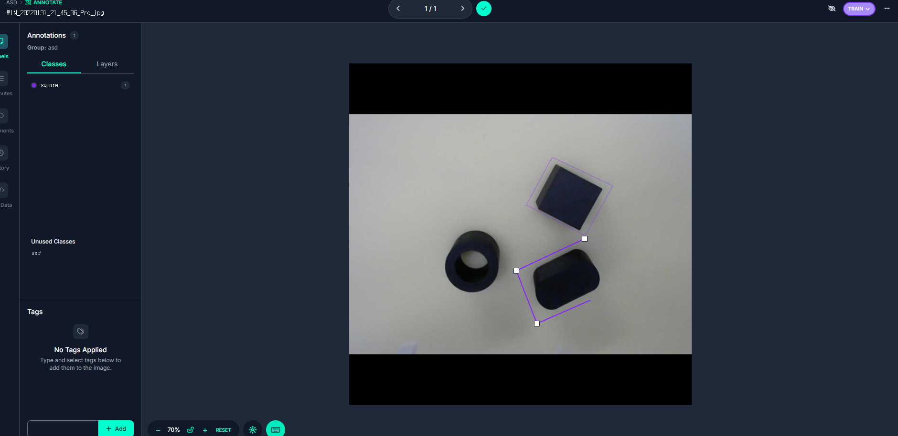

# Lecture 2: Pick and Place - 데이터 전처리 

## 목차
- [Lecture 2: Pick and Place - 데이터 전처리](#lecture-2-pick-and-place---데이터-전처리)
	- [목차](#목차)
	- [1. Roboflow를 이용한 이미지 라벨링](#1-roboflow를-이용한-이미지-라벨링)
	- [2. 데이터셋 생성](#2-데이터셋-생성)
	- [3. OBB를 위한 데이터셋 생성](#3-obb를-위한-데이터셋-생성)
	- [4. 마무리](#4-마무리)


## 1. Roboflow를 이용한 이미지 라벨링

Roboflow를 이용하면 데이터 전처리와 라벨링, 그리고 협업 작업을 간편하게 할 수 있습니다. 이를 활용하여 데이터 전처리를 실습해 보고자 합니다.

우선 `https://roboflow.com/`에 접속하여 줍니다.


좌측 탭에서 Projects를 클릭한 후, New Project를 클릭합니다.


Object Detection을 선택하고, 프로젝트 이름 등을 입력한 뒤에 Create Public Project를 클릭합니다.


이후 위와 같은 창이 나오면, 이전 실습에서 수집한 데이터를 드래그하여 업로드 해 줍니다.


이중 이미지 하나를 클릭하여, 선택한 이미지에서부터 라벨링을 시작할 수 있습니다.


위와 같은 창에서, 우측에서 **Bounding Box Tool**을 선택한 후, 물체 하나에 사각형 테두리를 쳐줍니다. 


이후 사각형 테두리 안에 있는 물체의 이름을 지정한 뒤, 이를 이미지 내에 존재하는 모든 물체에 대해 반복합니다.


위와 같은 과정을 업로드한 모든 이미지에 대해 반복합니다. 업로드한 모든 이미지에 대해 라벨링을 완료한 뒤 Add image to Dataset을 클릭하면 데이터셋에 라벨링된 이미지가 포함됩니다. 이때, 데이터셋에서 Train, Valid, Test에 사용할 이미지 갯수의 비율을 나누어 저장할 수 있습니다.


이후 좌측 탭에서 Datasets를 클릭하면, 라벨링한 이미지가 잘 데이터셋에 포함될 걸 확인할 수 있습니다. 또한 수동으로 각 이미지의 Split(Train, Valid, Test)을 조정하거나, 데이터셋에서 제외할 수 있습니다.


## 2. 데이터셋 생성

Create New Version을 클릭하여, 최종적인 데이터셋을 추출할 수 있습니다. 이후 다음과 같이 적용한 Preprocessing(데이터 전처리)을 선택할 수 있습니다. (기본 적용된 Auto Orient만 적용해도 무방합니다.)


또한, **Augmentation**(데이터 증강)을 선택할 수 있습니다. 데이터 증강은 데이터셋의 다양성을 높이기 위해 이미지에 회전, 크기 조정, 색상 변화 등을 적용하는 기법입니다. 이 옵션을 선택하면, 데이터셋의 크기가 증가하고 모델의 일반화 능력이 향상될 수 있습니다. 


Continue를 누르고, Create Dataset을 클릭하면, 데이터셋이 생성됩니다. 이후 Download Dataset을 클릭하고, YOLOv11 포맷을 선택, Download zip to computer를 선택한뒤 다운로드 하면 로컬 컴퓨터에 zip 파일로 생성한 데이터셋이 다운로드됩니다.


#### 데이터셋 파일의 구조

데이터셋을 다운로드하면, 다음과 같은 구조로 데이터셋이 생성됩니다.

```
datasets/
└── detection
	├── guide_objects.yaml
	├── train
	│   ├── images
	│   ├── labels
	└── valid
		├── images
		├── labels
```

이때, `guide_objects.yaml` 파일은 데이터셋에 포함된 객체들의 클래스 정보 및 train셋과 validation셋의 경로를 담고 있습니다. 이 파일을 YOLO 모델 학습시 데이터셋 경로로 지정해 주면 됩니다.

```
train: ../train/images
val: ../valid/images

nc: 6
names: ['circle', 'ring', 'square', 'rectangle', 'hexagon', 'oval']
```

## 3. OBB를 위한 데이터셋 생성

픽앤플레이스를 수행하기 위해 그리퍼를 물체가 기울어진 각도와 동일하게 맞춰야 합니다. 그러나 현재 Detection 모델은 물체의 기울어진 정도를 예측하지 않습니다. 따라서 YOLO OBB 모델을 이용하여 물체의 기울어진 각도 또한 예측해보고자 합니다.

YOLO OBB 학습을 위한 데이터셋을 생성하는 과정은 Detection과 거의 동일합니다. 다만, 데이터 라벨링시 Bounding Box Tool 대신 Polygon Tool을 이용해야 하며, 직사각형에 최대한 가깝게 물체를 둘러싸서 라벨링을 진행해야 합니다.



또한, 최종적인 데이터셋 다운로드시 **YOLOv8 Oriented Bounding Box** 포맷을 선택해야 합니다.


## 4. 마무리

이렇게 Roboflow를 이용하여 데이터셋을 라벨링하고, YOLOv11과 YOLO OBB 모델 학습에 사용할 수 있는 데이터셋을 생성하는 방법을 알아보았습니다. Roboflow는 데이터 전처리와 라벨링을 간편하게 할 수 있는 도구로, 다양한 기능을 제공하므로 활용해 보시기 바랍니다.

다음 실습에서는 Roboflow로 생성한 데이터셋을 이용하여, 픽앤플레이스를 위한 YOLO 모델을 학습시켜 보겠습니다.