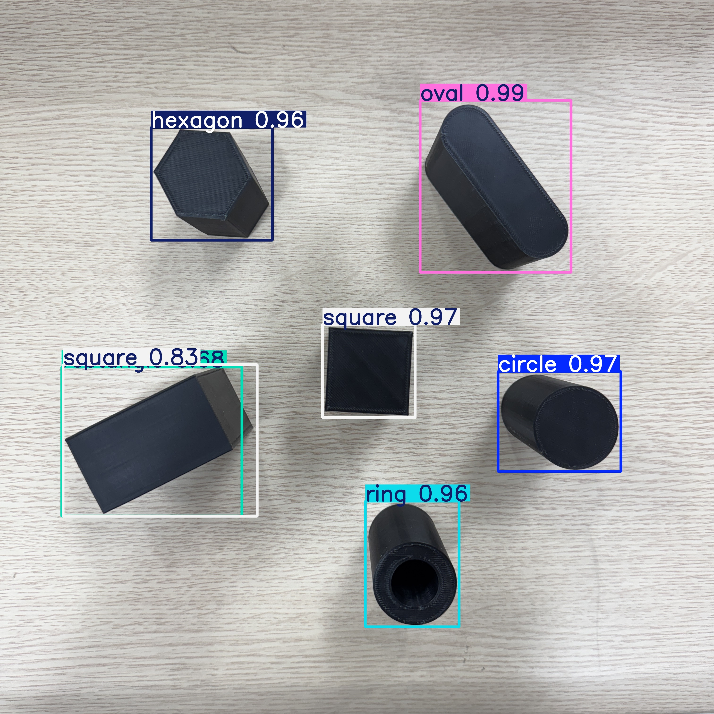

# Lecture 3: Pick and Place - YOLO 모델 학습

## 목차
- [Lecture 3: Pick and Place - YOLO 모델 학습](#lecture-3-pick-and-place---yolo-모델-학습)
  - [목차](#목차)
  - [0. 주의점](#0-주의점)
  - [1. YOLOv11 Detection 모델 학습](#1-yolov11-detection-모델-학습)
  - [2. YOLO OBB 모델 학습](#2-yolo-obb-모델-학습)


## 0. 주의점

성공적인 YOLO모델 학습을 위해서는 100장 정도의 충분한 양의 데이터셋이 필요합니다. 데이터셋이 충분히 수집되지 않았다면, 사전 제공되는 데이터셋을 이용하여 실습을 진행해도 무방합니다.

## 1. YOLOv11 Detection 모델 학습

`1_detection_train.py` 파일에서 데이터셋 파일 경로(yaml 파일)를 지정한 뒤, 실행하면 성공적으로 YOLOv11 Detection 모델을 학습할 수 있습니다. 

```
results = model.train(data="데이터셋파일경로", epochs=250, imgsz=640, device=0)
```

학습이 완료된 뒤, `eval_image.png`에 대해서 성공적인 학습 결과가 화면상에 나타남을 확인할 수 있습니다.



또한, `runs/detect/train/weights` 폴더내에 학습한 가중치가 생성됨을 확일할 수 있습니다. 해당 파일을 불러온 모델을 이용하여 이후 로봇이 촬영한 사진을 처리할 것이기에, 경로를 잘 기억해두시기 바랍니다.

## 2. YOLO OBB 모델 학습

`2_obb_train.py` 파일에서 데이터셋 파일 경로(yaml 파일)를 지정한 뒤, 실행하면 성공적으로 YOLO OBB 모델을 학습할 수 있습니다.
 


`runs/obb/train/weights` 폴더내에 학습한 가중치가 생성됨을 확일할 수 있습니다.

또한, `3_use_trained_model.py` 파일에서 학습된 모델을 불러와 사용하는 것을 실습할 수 있습니다.