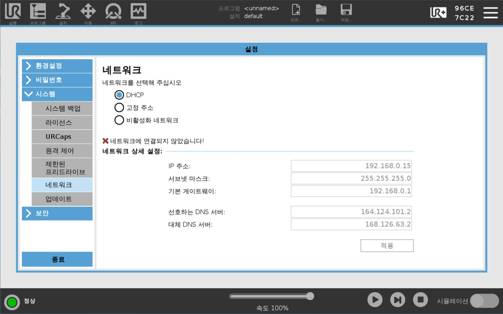
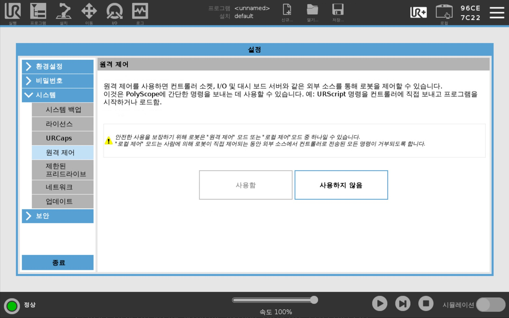

# Lecture 2 
## 강의 목표
- Lecture1을 통해 배운 tcp socket에 대한 이해를 바탕으로, 스크립트를 로봇에 전송해봅니다. 
- UR 로봇에 사용되는 스크립트에 대한 이해를 얻습니다.

## 실습전에
<div align="center">
  
</div>

우측상단 메뉴(햄버거) 버튼 클릭 후 "설정>시스템>네트워크" 탭에서 '비활성화 네트워크' 선택 후 바로 'DHCP'를 선택해주세요. 정상적인 경우, 잠시 기다리면 IP주소가 표시 됩니다.
<div align="center">
  
</div>
"시스템>원격제어" 탭에서 원격제어를 활성화 해주세요.


## 실습 1

### 파이썬 파일 실행하기
`helloworld.py`를 실행합니다.
```python
robot_url = "192.168.0.5"
socketPrimaryClient.connect((robot_url, 30001)) # 30001 --> Primary interface
```

위 코드를 보시면, 소켓의 타겟 url에 Lecture 1과 다르게 루프백IP(127.0.0.1 - 자기 자신의 아이피)가 아닌, `robot_url` 변수에 로봇의 IP를 바인딩 후 ```30001```번 소켓에 전송하는것을 볼 수 있습니다.

```30001```번 포트는 UR 내부에서 사용되는 포트 규약으로서, ***Primary Interface***를 나타냅니다.

스크립트를 전송할 수 있는 ```30002```번 포트가 존재하는데요.

UR의 [문서](https://www.universal-robots.com/products/ur-developer-suite/archives/tutorials/urscript-socket-communication/)에 따르면 ```30001```번 포트는 고수준의 명령에 사용되고, ```30002```번 포트는 우선순위가 낮은 작업과 중요하지 않은 동작 제어에 사용된다고 명시되어있습니다.

### 스크립트 

```python
socketPrimaryClient.send((script + "\n").encode())
```
이 코드는 앞서 Lecture1에서 처럼 ```send``` 함수를 사용해 script 뒤에 **줄 바꿈을 나타내는 이스케이프 문자**인 ```\n```를 붙이고 byte 형식으로 인코딩해 로봇으로 전송합니다.  

script는 다음과 같은 내용을 담고있습니다.
```python
script = """
def helloworld():
    popup("Happy learning!")
end
"""
```
해당 스크립트의 내용은 `Happy learning!` 이라는 문자열을 다이얼로그를 통해 띄워주는 코드입니다.


### 코드를 조금 더 예쁘게 만드는 법
```python
PORT_PRIMARY_CLIENT = 30001
PORT_SECONDARY_CLIENT = 30002

def sendScriptViaPrimaryClient(robot_url, script):
    socketPrimaryClient = socket.socket(socket.AF_INET, socket.SOCK_STREAM)
    socketPrimaryClient.connect((robot_url, PORT_PRIMARY_CLIENT))
    socketPrimaryClient.send((script + "\n").encode())
    socketPrimaryClient.close()

def sendScriptViaSecondaryClient(robot_url, script):
    socketSecondaryClient = socket.socket(socket.AF_INET, socket.SOCK_STREAM)
    socketSecondaryClient.connect((robot_url, PORT_SECONDARY_CLIENT))
    socketSecondaryClient.send((script + "\n").encode())
    socketSecondaryClient.close()
```
이렇게 함수와 상수로 정의해두면 코드의 재사용성을 강화할 수 있습니다.


## 실습 2
이번 실습에서는 스크립트를 변수에 직접 작성하는 방식이 아닌, 파일에 저장된채로 불러오는 방식에 대해 알아보겠습니다.

코드 전문은 `scriptfile.py`를 참고하시기 바랍니다.

### 코드 구조
``` python
def sendScriptFile(robot_url, script_path, port=PORT_PRIMARY_CLIENT):
    script = getScriptFromPath(script_path)
    sendScript(robot_url, script, port)
```
우선 `sendScriptFile()`함수는 robot_url과, script_path, 그리고 전송할 포트를 매개변수로 받아옵니다.

그 후 `getScriptFromPath()` 함수를 통해 스크립트 파일 경로로부터 실제 파일 내용을 script 변수에 저장한 후,

`sendScript()` 함수로 전송하는 코드입니다. 

### 동적으로 파일 불러오기
우선 `getScriptFromPath()`를 차근차근 둘러보겠습니다.

```python
def getScriptFromPath(script_path):
    # Open the file in read mode
    with open(script_path, 'r') as file:
        # Read the contents of the file
        script = file.read()
        # print(script)
    return script
```
함수의 내용은 생각보다 간단합니다. `open()` 함수를 사용해 `script_path`로부터 불러옵니다.

이때 `'r'`은 읽기 전용으로 불러오겠다는 의미입니다. 

만일 스크립트의 변경을 원하시면 `'w'`를, 새로운 내용을 추가하고 싶다면 `'a'`를 사용하시면 됩니다.

실무에 적용하기 위해서는 파일 경로가 잘못되었을 경우를 대비하여, `try-except`를 사용한 예외 처리를 통해 파일을 안전하게 불러올 수 있도록 해야 합니다.

`sendScript()`의 구조는 **실습1**에서 진행한 내용과 동일하므로 생략하겠습니다.

### 실제 사용 예시

```python
if __name__ == "__main__":
    robot_url = "192.168.0.5"
    script_path = "scripts/helloworld.script"
    # script_path = "scripts/slowmove.script"
    # sendScriptFile(robot_url, script_path, PORT_PRIMARY_CLIENT)
    sendScriptFile(robot_url, script_path, PORT_SECONDARY_CLIENT)
```

이 코드는 실제 파일 경로를 `script_path`에 바인딩한 후 앞서 확인한 `sendScriptFile()` 함수를 통해 로봇에 전달합니다.

만일 다른 파일을 전송하고 싶으시다면, `script_path`의 내용만 변경해주시면 됩니다.

이를 응용하여 버튼을 클릭하면 특정 스크립트를 로봇에 전송하는등의 자동화를 구성할 수 있습니다.

