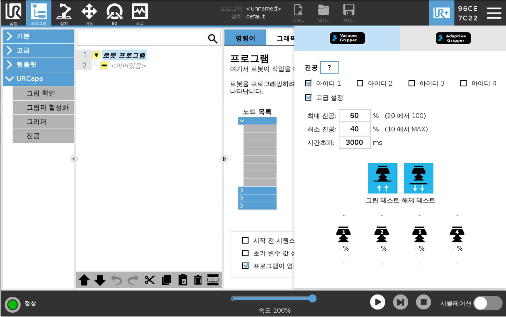
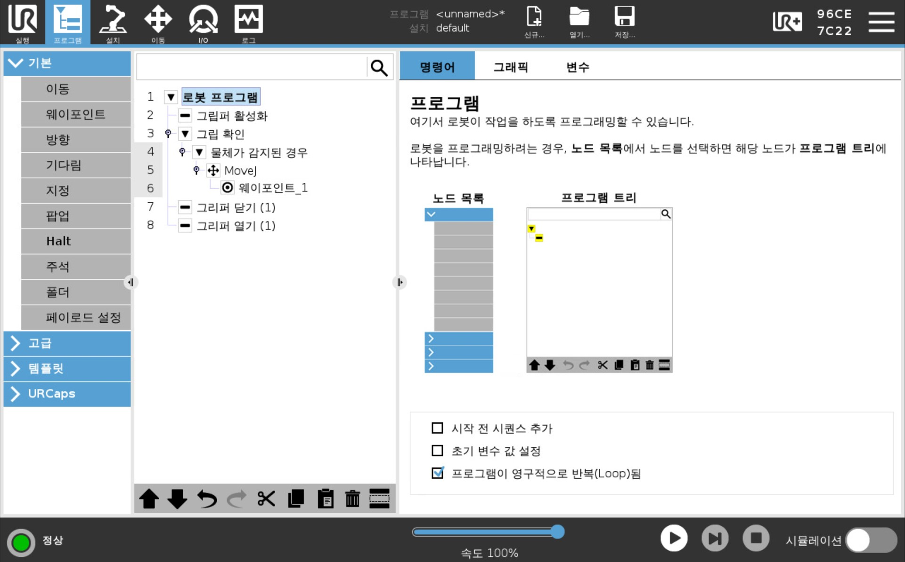
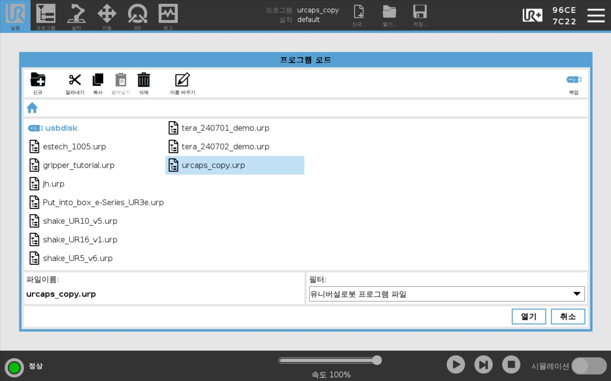

# Lecture 4
## 강의 목표
UR로봇의 기능을 확장해주는 URCaps를 원격으로 활용해봅시다.

## URCaps
URCaps는 UR 로봇 시리즈를 위한 소프트웨어 프레임워크입니다. URCaps는 플러그인과 같은 역할을 하며, 사용자가 로봇의 기능을 확장하고 사용자 정의할 수 있도록 돕습니다. 이를 통해 다양한 기능을 추가하거나 기존 기능을 개선할 수 있습니다. 

## URCaps 파일을 로봇에서 불러오는 방법
0. URCaps 기능이 정상적으로 동작하는지 확인합니다.

  

1. Polyscope에서 새 프로그램을 생성합니다.

2. 프로그램에 URCaps 관련 노드를 추가합니다.

  

3. 프로그램을 저장합니다.

4. 프로그램(**.script 파일**, .urp 파일 아님)을 USB 드라이브를 사용하여 컴퓨터로 전송합니다.

  

5. 에디터(VScode)에서 프로그램을 엽니다.

### 실습

'example_pristine.script'와 'example_urcaps_robotiq.script'을 비교해 봅니다.

어떤 차이점이 존재하나요?

## URCaps 함수 수정해보기

### 실습

'scriptfile.py'를 이용하여 UR로봇으로부터 가져온 스크립트를 실행해보고, 원래의 프로그램(.urp)와 동일하게 동작하는지 확인해봅시다.

이전 예제(~lecture3)에서 연습한 내용을 바탕으로 복사해온 script 파일을 수정해보세요. (원본을 백업해두는걸 잊지마세요!)

